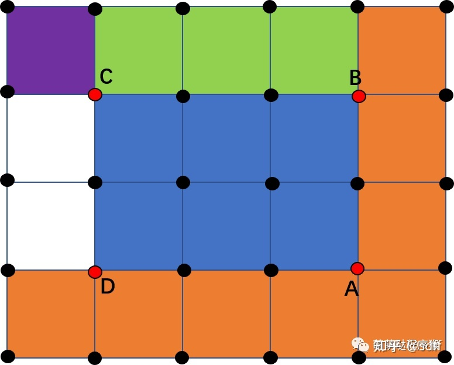

# Image Editting(C#)
----
## Outer Libs
```xml
<PackageReference Include="OpenCvSharp4" Version="4.6.0.20220608" />
<PackageReference Include="OpenCvSharp4.runtime.*" Version="4.6.0.20220608" />
```

## Reference Docs
参考论文详见同目录下的`Docs`文件夹

有关均值滤波的参考文章:
* [图像处理算法优化基础](https://zhuanlan.zhihu.com/p/355255078)
* [均值滤波简介及优化](https://zhuanlan.zhihu.com/p/355260752)
* [高斯滤波简介及优化](https://zhuanlan.zhihu.com/p/355263110)
* [中值滤波简介及排序策略](https://zhuanlan.zhihu.com/p/355266029)

## 积分图
----
积分图的内容详见下
* [图像处理算法优化基础](https://zhuanlan.zhihu.com/p/355255078)

在此处我大概放一张图就能够明白其方法，虽然目前看起来没什么用，但是其对于后续对图像处理的一些算子进行算法优化的用途很大。
<center></center>


## 均值滤波的处理
----
均值滤波的中文简介大概参考见下:
* [均值滤波简介](https://zhuanlan.zhihu.com/p/355260752)

我们知道很多图像都可以看做有很多噪点，为了处理这些噪点，我们第一会想到将这些噪点融于四周，将其与四周取平均，这样子其对于视觉上的观感按直觉来说会减少一点。这是一种滤波的策略，将噪声和环境取平均来减少波动。

通过上面的描述，我们已经了解了均值滤波的本质，就是取平均值，因此我们就容易进行实现。但是，我们想到，这玩意假如真要搞，那滤波算子size越大，算起来就越来越慢，这时候我们就可以进行优化。

我们引入上面提到的积分图的思想，来对其进行优化。其具体原理看下图就能立刻理解:
<center></center>
我们可以看到，如果我们想求得蓝色矩形所围成的像素点的总和，那么若我们知道了整张图的像素积分图，那么其容易表示为:

$$
\sum_{\Omega_{Blue}} Pixel= I(A) + I(C) - I(B) - I(D)
$$

**不过**急需注意，此处的`B`,`D`,`C`的位置都有问题，其都应该往外扩张一格，知乎上的文章并未指出此问题，所以在这里提一下。

## 高斯滤波的处理
----
高斯滤波的中文简介大概参考见下:
* [高斯滤波简介](https://zhuanlan.zhihu.com/p/355263110)

高斯滤波的本质实质上是根据自然中常见的正态分布而产生，运用正态分布能够增强当前选中点并减弱周围点带来的波动差异。

因此思路上很简单，我们以选中点为原点构造二维的高斯函数，然后卷积作用于图像上即可。但是不难发现，这个和均值滤波一样，有时间复杂度过大的问题，因此下面我们主要介绍如何优化。

首先我们能够发现，高斯函数实际上是能够拆分为XY无关的两个相乘的函数

$$
\begin{align*}
W(i,j)&=\frac{1}{2\pi\sigma^2}\cdot e^{-\frac{(i-n)^2+(j-n)^2}{2\sigma^2}}\\
&=\frac{1}{2\pi\sigma^2}\cdot e^{-\frac{(i-n)^2}{2\sigma^2}}\cdot e^{-\frac{(j-n)^2}{2\sigma^2}}\\
&=\frac{1}{2\pi\sigma^2}\cdot f(x)\cdot f(y)
\end{align*}
$$

同时由于我们最后其实需要归一化处理因此此处的系数我们都可以忽略，因此可以写为如下形式。

$$
\begin{align*}
W(i,j)=f(x)\cdot f(y)
\end{align*}
$$

我们接下来将其带入卷积表达式，并利用求和符号的交换性进行化简

$$
\begin{align*}
Result(i,j) &= \sum_{x=-n}^{n}\sum_{y=-n}^{n}P(i+x,j+y)\cdot W(i+x,j+y)\\
&=\sum_{x=-n}^{n}\sum_{y=-n}^{n}P(i+x,j+y)\cdot f(i+x)\cdot f(j+y)\\
&=\sum_{x=-n}^{n}f(i+x)\cdot[\sum_{y=-n}^{n}P(i+x,j+y)\cdot f(j+y)]
\end{align*}
$$

通过这个化简我们能够发现，原来的$(2n+1)^2$次计算，在化简后能够减少到$2(2n+1)$次。用下面这幅图片看的话可能更加清晰。
<center></center>

其实上述的方法和二重积分类似，假如我们需要求一个二重积分，那么我们可以先将其固定一个变量化为一个一重积分，完成这个积分后再次来一次一重积分。按照这种策略，我们也能够求出二重积分的值。而积分是在连续情况下，我们将其类比至离散情况下。

## 中值滤波的处理
----
首先我们先通过文章看一下什么是中值滤波
* [中值滤波简介及排序策略](https://zhuanlan.zhihu.com/p/355266029)

emmm，具描述中值滤波针对椒盐噪声有非常好的效果，那么首先我们先来看看什么是椒盐噪声，以及如何通过椒盐噪声引出中值滤波的处理策略。

那么，什么是椒盐噪声？或者更直接点，什么是噪声？我推荐下面这篇文章(其实是因为我只看了这篇)
* [常见的噪声](https://blog.csdn.net/weixin_40446557/article/details/81451651)

接下来我们拿出文章中对椒盐噪声的定义。
* 椒盐噪声定义
>椒盐噪声，椒盐噪声又称脉冲噪声，它随机改变一些像素值，是由图像传感器，传输信道，解码处理等产生的黑白相间的亮暗点噪声。椒盐噪声往往由图像切割引起。

加入椒盐噪声前：
<center></center>
加入椒盐噪声后：
<center></center>

我们能看到，噪声影响带来的是图片中随机出现的黑点或者白点，其在图片中的分布是随机的，并没有特殊的分布规律。因此其给视觉带来的影响也是总体上的，而不是在某一区域特别明显。

因此我们可以总结出椒盐噪声其影响的范围是相互独立无影响的。

欸，这时候我们思考一个问题，假如其是相互独立无影响的，那么我们可以认为这个噪点产生的影响范围一定有限，以曼哈顿距离来考虑一定有一个最远距离，在这个距离内不会碰到任何其它噪点。这个性质和分子距离的定义也类似，可以进行类比

那么，了解噪点的性质，我们再思考一下这里的图片有什么独特的性质。我们看到图片，一张图片中假若存在一个能产生视觉上效应的物体，其RBG各通道内的值应该是近似连续的，只有边缘上才会有明显的连续性变化。因此，假如我们能够将噪点所在的位置的像素点值取成邻近的中位数，而不是平均，那么我们就能够用临近的有效信号对噪点进行修正。

至于为什么取中位数而不取众数等，我认为这应该是由于假如我们从一个噪点来考虑，那么补全其信号的确都差不多，但是假如我们通过一个正常点来考虑，它取中位数是正确的可能性大于众数，因为考虑到大部分面上的像素点都连续一般而言，一个运算符的中心一般就是中位数，因此取中位数的值能够较好的保证没有噪点的像素点信号不被破坏。